# KeyNet Split Keyboard


## Abstract
This documentation details the design, fabrication, and firmware architecture of KeyNet, a custom split ergonomic input device. Developed to mitigate repetitive strain injuries (RSI) and optimize high-performance workflows, the system integrates a columnar-staggered physical layout with a multi-layered logical hierarchy. The device leverages the QMK firmware ecosystem to provide context-aware input modalities for competitive gaming, digital artistry, and stenography.

## Design Philosophy & Ergonomics
KeyNet reverses the traditional keyboard paradigm by prioritizing the physiological needs of the user over manufacturing convenience. The architecture is built upon a "True Split" philosophy, separating the device into two independent modules. This separation allows the operator to position their hands at natural shoulder width, effectively neutralizing the ulnar deviation strain common in fixed-rectangle keyboards.

Complementing the split design is a columnar key arrangement. Unlike the diagonal stagger of legacy typewriters, KeyNet aligns keys in vertical columns that correspond to the natural extension and retraction vectors of the fingers. This minimization of lateral movement reduces finger fatigue during extended operation. Furthermore, the design redistributes the functional load by employing dedicated thumb clusters. The strongest digits, typically relegated to a single spacebar, are here tasked with managing Enter, Backspace, and Layer shifting, thereby relieving the weaker pinky fingers of strenuous reach operations.

Beyond ergonomic separation, the split architecture enables **Single-Handed Viability**. Each module is designed to function as an independent input device. This capability is particularly critical for workflows involving intensive mouse usage (e.g., CAD, FPS gaming), allowing the operator to maintain full keyboard control with the left hand while the right hand remains engaged with the mouse, eliminating the micro-interruptions of switching devices.

**Structural Design.** The chassis itself follows a utilitarian "Unibody" engineering philosophy, where efficiency is paramount. The switch plate and outer frame are synthesized as a single continuous 3D-printed unit. This integration reduces the total part count and significantly mitigates the acoustic vibration and rattling often associated with multi-part assemblies. The geometry is further optimized for additive manufacturing, allowing the complex curvature to be produced without the waste of support material. 

The physical geometry was realized through a multi-stage CAD workflow. The initial switch matrix was plotted in **Keyboard Layout Editor (KLE)** and converted to a manufacturing vector file via **Swillkb Builder**. This 2D data was imported into **Blender**, serving as the dimensional anchor for the enclosure. The ergonomic top surface was sculpted using vector-based organic modeling techniques, then extruded to generate the final unibody chassis.


*Figure 1: Isometric perspective highlighting the columnar key stagger and split module architecture.*


*Figure 2: CAD rendering of the chassis front geometry, illustrating the integrated switch plate.*

## Hardware Architecture
The internal architecture of KeyNet is defined by a fully hand-wired scanning matrix, a construction method chosen to provide absolute freedom in 3D key placement. Unlike PCB-based designs which constrain switches to a 2D plane, this "skeleton" approach allows the ergonomic contours of the chassis to dictate the electronic topology. The matrix is organized logically into a grid of 5 Rows and 8 Columns per hand. This configuration enables the microcontroller to scan up to 40 distinct inputs using only 13 General Purpose Input/Output (GPIO) pins (refer to **Figure 11** for the mirrored matrix implementation). Signal integrity is enforced by 1N4148 switching diodes wired in a Column-to-Row orientation; these components prevent current backflow ("ghosting"), ensuring that the controller allows for N-Key Rollover (NKRO) even during high-speed actuation.


*Figure 3: Logical wiring overlay demonstrating the Row/Column intersection and diode placement.*


*Figure 4: Physical realization of the hand-wired matrix on the left control module.*

The system's processing core is the ATmega32U4 microcontroller, utilizing the Pro Micro development board platform. To optimize scanning efficiency, the firmware interface is mapped to specific AVR ports. The physical rows are driven by a combination of pins from Port F (F4, F6) and Port B (B1, B2, B5), while the columns utilize the remaining digital I/O availability on Ports F, C, D, and E.

Inter-module communication is established through a single-wire serial protocol (Soft Serial) on pin D3. This dedicated data line allows the two independent controllers to synchronize layer states and keypress data in real-time over a standard TRRS cable, enabling the unified logical behavior of the physically separated halves.

User input is further augmented by two EC11 rotary encoders, which introduce analog control capabilities to the digital array. These components operate on quadrature encoding principles, generating two out-of-phase signals (Channel A and Channel B) to indicate rotational direction. To mitigate mechanical contact bounce—a common source of "phantom" scroll inputs—the design implements a hardware low-pass filter using 0.1µF ceramic capacitors on the signal lines. This hardware-level debouncing relieves the firmware of intensive signal processing, ensuring responsive and jitter-free operation for volume and timeline scrubbing tasks.


*Figure 5: Pro Micro (ATmega32U4) pinout reference used for hardware mapping.*

## Firmware Architecture & Input Logic
KeyNet operates on a strict layer hierarchy defined in the firmware, functioning as a stack of transparent input sheets. When a key is pressed, the system queries the highest active layer; if the key is undefined (transparent), it falls through to the layer below. The compilation order prioritizes momentary overlays (Adjust, Raise, Lower) above base layers (Qwerty, Game, Brush), ensuring that system-level controls remain accessible regardless of the active application mode.

The foundation of the input system is the **QWERTY** layer, serving as the primary alphanumeric interface. KeyNet leverages a **Home Row Efficiency** philosophy to maximize input speed, heavily utilizing dual-function key logic. The thumb keys (Space, Backspace, Enter) activate extension layers when held, bringing navigation and symbols to the user's resting position. Furthermore, the system implements **Home Row Modifiers**, transforming the primary home row keys into modifiers during sustained actuation. This mapping is mirrored symmetrically across both hands: the index fingers control Shift, middle fingers control Ctrl, ring fingers control Alt, and pinky fingers control the OS/Win key. For example, tapping 'F' registers the character, while holding 'F' functions as a Shift modifier. This architecture allows the user to execute complex hotkey combinations without lateral hand movement. The **Lower** layer brings navigation keys and a right-hand numpad to the home row, while the **Raise** layer provides access to symbols and media controls. Holding both Lower and Raise simultaneously activates the **Adjust** layer, a hidden system control panel.

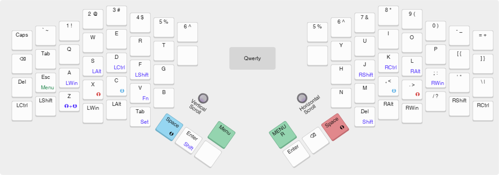

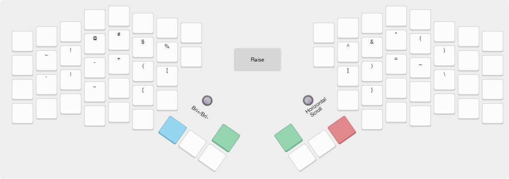
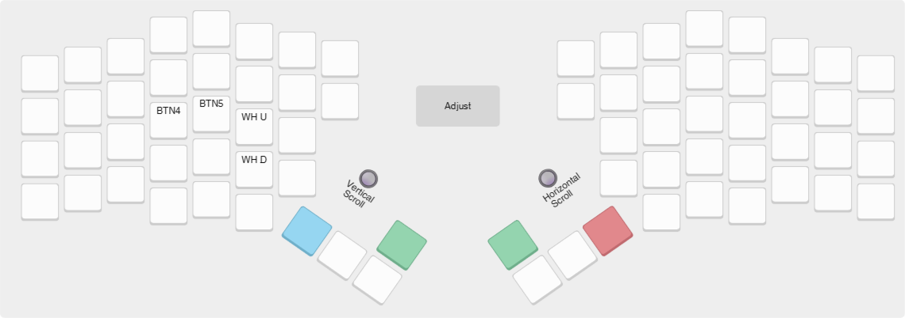

Central to the KeyNet philosophy is the **Menu** layer, which acts as a persistent mode selector. Access is managed via two distinct keys: **MENU** and **MENU_R**. While both provide momentary access to the interface, **MENU_R** sets a unique state flag within the firmware. This architecture allows the system to distinguish between left-hand and right-hand activation, enabling context-sensitive logic for the rotary encoders based on the user's current hand position. This hub allows the operator to swap the underlying base layer to suit specific tasks. For competitive environments, the **Game_R (Raw)** mode replicates Qwerty but eliminates mod-tap latency for instant actuation. The **Game (Shifted)** mode offsets the home position to the right (ESDF), exposing additional columns for macro usage. A unique **Game_2** mode splits the input logic, converting the right half into an independent arrow-key controller for local co-op gaming.


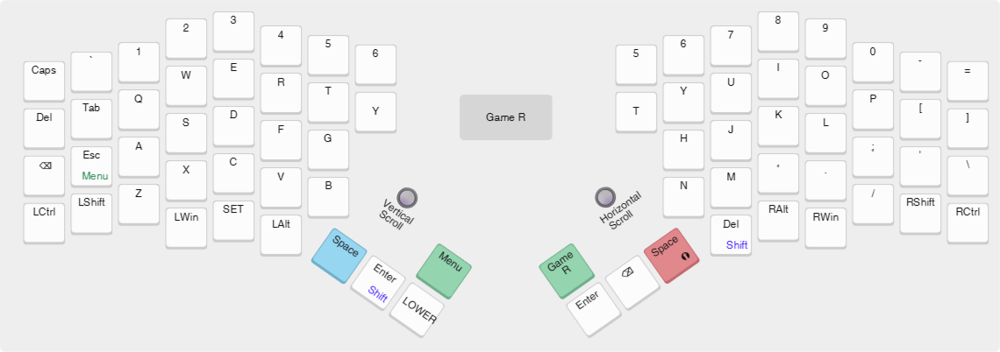
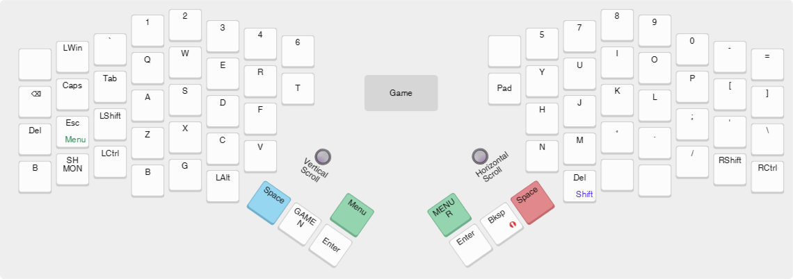
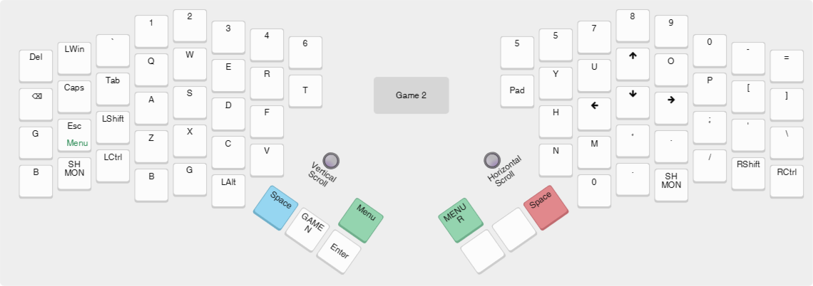
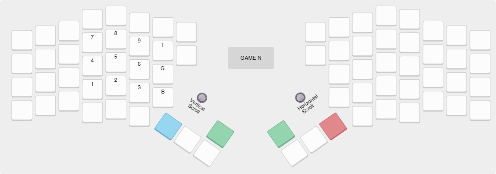

Productivity workflows are addressed by the **Brush** layer, which groups common digital art shortcuts (Undo, Cut, Copy, Paste) onto the left hand, and a dedicated left-hand **Numpad** layer. Advanced text entry is supported by the **Gemini** layer, an implementation of the Gemini Stenography protocol designed for use with Plover, and the **Set** layer, which utilizes a chorded modifier system where column position dictates the applied modifier (Shift, Ctrl, Alt, Win).

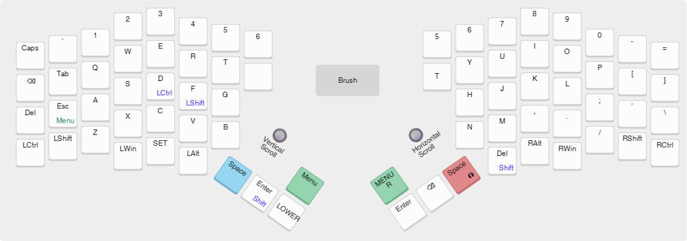
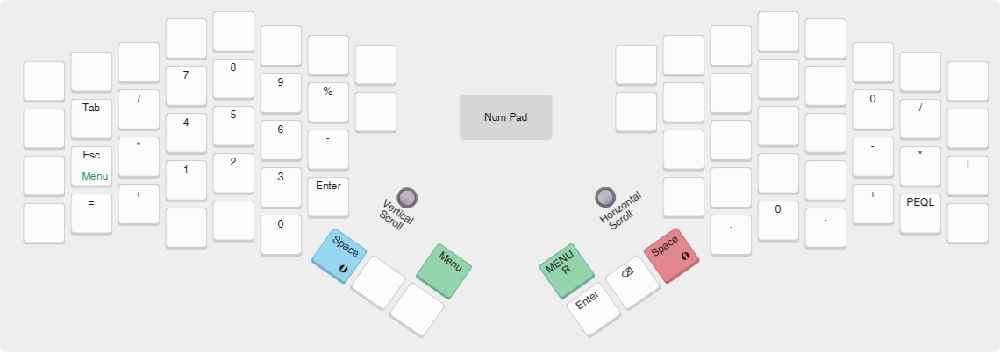
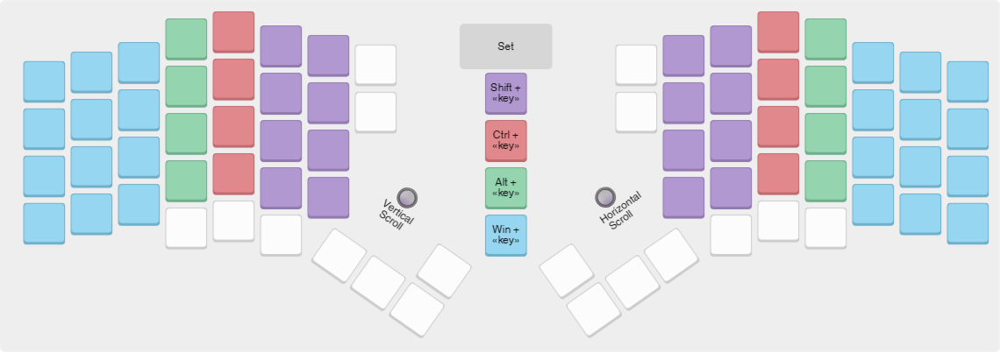
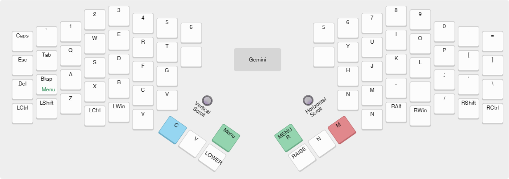
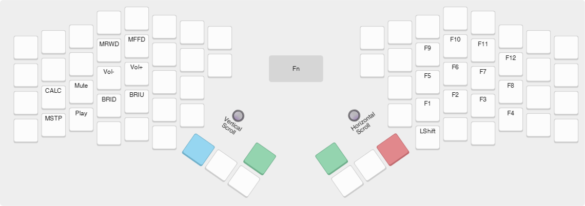
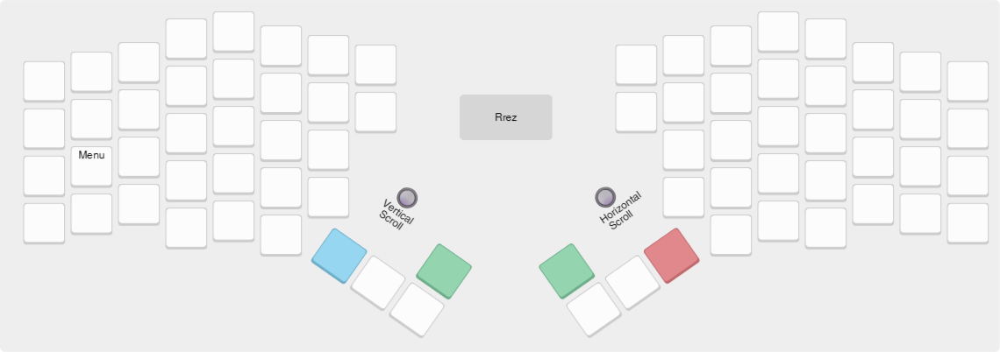

## Fabrication & Configuration
The realization of KeyNet requires the integration of additive manufacturing, electronics assembly, and firmware deployment. Components were sourced via global marketplaces (**AliExpress**), and the electronic core comprises two **Pro Micro** microcontrollers (ATmega32U4, 5V, USB-C variant), driving a matrix of **MX-style mechanical switches** (Redragon/Outemu 3-pin). These switches are mounted into **Gateron/Kailh hot-swap sockets** which are soldered directly to the wire matrix, preserving modularity. Signal integrity is maintained by **1N4148 through-hole diodes**; while SMD 1N5819W diodes were utilized on the left-hand prototype, through-hole components are strongly recommended for their structural utility in hand-wiring. Analog input is provided by two **EC11 rotary encoders** (30-position), and the halves communicate via a 4-pin **TRRS cable** carrying a standard serial protocol (VCC, GND, Data).

Physical fabrication of the enclosure is achieved via FDM 3D printing using **PLA** filament. The geometry is optimized for bridging, allowing for support-free fabrication on standard printers using **Ultimaker Cura**. Structural rigidity and acoustic density are maximized by utilizing **3 wall lines** and **20%+ infill**. Due to the thermal properties of PLA, strictly controlled environmental temperatures (no drafts) are required during printing to prevent shrinkage and ensure precise switch fitment. Assembly is finalized using **M3x8 self-tapping screws**. It should be noted that standard-length screws may require modification to fit the mounting depth. In this prototype, longer screws were shortened manually; however, this process risks deforming the screw tip, which can compromise the tapped threads within the plastic backplate due to pitch irregularities. For optimal structural integrity, sourcing precision-length screws is recommended over manual modification.

During electronics assembly, special attention must be paid to the rotary encoders to ensure reliable operation. The **Side A** (3 pins) handles quadrature encoding; the outer pins (Signal A/B) connect to digital inputs, while the middle pin connects to Ground. To eliminate signal noise (phantom scrolls), **0.1µF ceramic capacitors** must be soldered between the Signal pins and Ground. The **Side B** (2 pins) functions as a standard switch and connects to the matrix Row and Column.


*Figure 6: Schematic for encoder signal filtering and debouncing.*

Firmware deployment is handled via the **QMK MSYS** environment using the QMK CLI. The project compilation is initiated with:

```sh
qmk compile -kb keynet/rev1 -km default
```

Flashing is performed individually for each half. To enter bootloader mode, the controller must be reset. This is achieved by bridging the RST pin to GND. Due to the pin's sensitivity, a dedicated jumper is often unnecessary; simply touching the RST contact with a conductive implement held in the hand (such as a needle or SIM ejector tool) is typically sufficient to trigger the reset via capacitive grounding.

**Left Unit:**
```sh
qmk flash -kb keynet/rev1 -km default -bl avrdude-split-left
```

**Right Unit:**
```sh
qmk flash -kb keynet/rev1 -km default -bl avrdude-split-right
```

## References & Toolchain
The realization of the KeyNet project relied on a specialized suite of software standards and procurement resources. The firmware architecture is built upon the **Quantum Mechanical Keyboard (QMK) Firmware** framework, with local development and deployment handled via the **QMK MSYS** build environment.

The physical design process utilized **Keyboard Layout Editor (KLE)** for initial spatial plotting, followed by **QMK Converter** to translate raw metadata into firmware-compatible formats. **Swillkb Builder** facilitated the generation of SVG vector data for switch socket positioning, which served as the dimensional anchor within **Blender** for the organic modeling of the unibody chassis.

Specialized input modalities were implemented according to the **Open Steno Project (Plover)** documentation. Component procurement was conducted primarily through the **AliExpress** global marketplace.

**Resource Locations:**
*   [QMK Firmware Documentation](https://docs.qmk.fm/)
*   [QMK MSYS](https://msys.qmk.fm/)
*   [Keyboard Layout Editor](https://www.keyboard-layout-editor.com/)
*   [QMK Converter](https://qmk.fm/converter/)
*   [Swillkb Builder](http://builder.swillkb.com/)
*   [Open Steno Project](https://www.openstenoproject.org/plover/)

## Visual Appendix


*Figure 7: Top-down view of the complete KeyNet system with interconnect cable.*


*Figure 8: Compact configuration demonstrating the split form factor.*


*Figure 9: Profile view of the left control module.*


*Figure 10: Profile view of the right control module.*


*Figure 11: Internal view of the right module, mirroring the matrix structure.*


*Figure 12: CAD rendering of the chassis rear geometry, illustrating the integrated switch plate and mounting points.*
